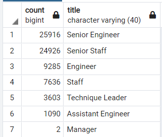
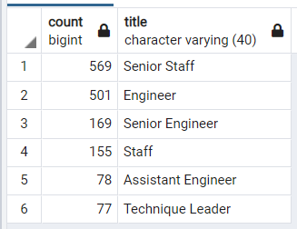
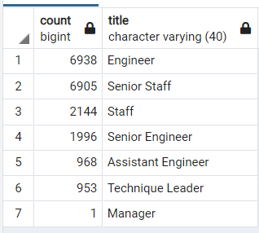

# Silver-Tsunami-Analysis

## Overview of Analysis
### Purpose
The analysis is to help the company to determine the number of the retiring employees per title, and identify employees who are eligible to participate in a mentorship program, based on which the company can further plan the "Silver Tsunami" program to go through the transition properly.

## Results
- Total number of the retiring employees is going to be 72,458, with a breakdown into each title as shown in following image:

- Comparing the retiring_titles vs retirement_titles, we can find total employees included in the retirement_titles is 133,776, which almost doubled the actual number of the retiring employees, meaning among all the retiring employees, almost everyone has got at least title change once.
- Total number of employees who were born in 1965 is 1,549, with a detailed breakdown into each title as shown in following image:

- Comparing the mentorship_titles vs retiring_titles, we are missing 1 title - Manager from the data selection for mentorship program.

## Summary
### How many roles will need to be filled as the "silver tsunami" begins to make an impact?
 We would have to fill at least 70,909 employees considering the number of retiring employees and employees eligible mentorship program;

### Are there enough qualified, retirement-ready employees in the departments to mentor the next generation of Pewlett Hackard employees?
 No. There're only 1,549 who is eligible for the mentorship program under current criteria. Furthermore, we are missing employee under this criteria for the "Manager" title.

### Additional Insights
- Overview of the company employees status
  We would like to help company understand the real impact on company overall resulted from the retiring employees. So we would perform the LEFT JOIN between employees table and title table, using DISTINCT function to get the overall employee number and each employee's latest job title. Using the query below:
 
SELECT DISTINCT ON (emp_no) e.emp_no,
 e.first_name,
 e.last_name,
 ti.title,
 ti.from_date,
 ti.to_date
 INTO total_employees_title
 FROM employees as e
 LEFT JOIN titles as ti
 ON e.emp_no = ti.emp_no
 ORDER BY e.emp_no;
 
 The total number of employees is 300,024. Based on the total employee number and retiring number, we can tell around 24% of the senior employees are going to retire from the company, which is a quite significant number and human resources change to a company. 

- Mentorship Program Selection Criteria
  We would like to further break down the titles of the employees who are eligible for the mentorship program. By performing following query, we can tell there's no manager eligible for the mentorship program under the current criteria:
 
SELECT COUNT(title), title 
 INTO mentorship_titles
 FROM mentorship_eligibilty
 GROUP BY title
 ORDER BY COUNT(title) DESC;
 
  Based on the current result, we would like to try to enlarge the criteria to allow more employees into the selection, and see if that can help us include candidate for Manager role. 
 
Attempt: Adjust the criteria to allow the employees who were born between 1964 to 1965 also become eligible for the program by performing following query:
 
SELECT DISTINCT ON (emp_no) e.emp_no,
 e.first_name,
 e.last_name,
 e.birth_date,
 de.from_date,
 de.to_date,
 ti.title
 INTO mentorship_eligibilty2
 FROM employees as e
 	LEFT JOIN dept_emp as de
 	ON e.emp_no = de.emp_no
 	LEFT JOIN titles as ti
 	ON e.emp_no = ti.emp_no
 WHERE (e.birth_date BETWEEN '1964-01-01' AND '1965-12-31')
 AND (de.to_date = '9999-01-01')
 ORDER BY e.emp_no;
  
SELECT COUNT(emp_no),title 
 FROM mentorship_eligibilty2
 GROUP BY title
 ORDER BY COUNT(emp_no) DESC;
  
Please see the adjusted result through the image below. Now we can see at least 1 manager is included in the mentorship program, and the total number of employees who are eligible for the program becomes to 19,905.
  
